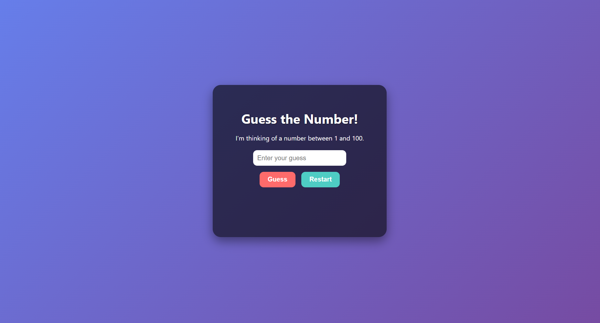

# Guess the Number 🎯

A simple browser-based game built with **HTML, CSS, and JavaScript**.  
Try to guess the secret number between 1 and 100 with hints along the way!

---

## Features

- Random number generation between 1–100
- Input validation (only numbers between 1 and 100)
- Feedback messages:
  - Too high / Too low
  - Close guesses (“Close! Try a bit higher/lower”)
- Attempts counter
- Restart button to play again
- Stylish UI with gradient background and card design
- Visual feedback for correct guesses

---

## How to Play

1. Enter your guess in the input box.
2. Click **Guess** to submit.
3. Follow the hints until you find the secret number.
4. Click **Restart** to start a new game.

---

## Tech Stack

- **HTML** – Game structure
- **CSS** – Styling and animations
- **JavaScript** – Game logic

---

## Screenshots

 <!-- Add your screenshot here -->

---

